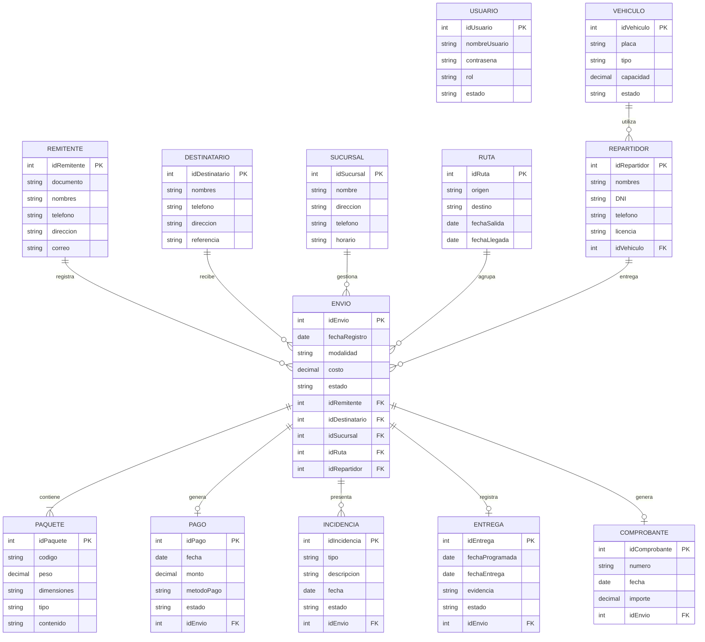
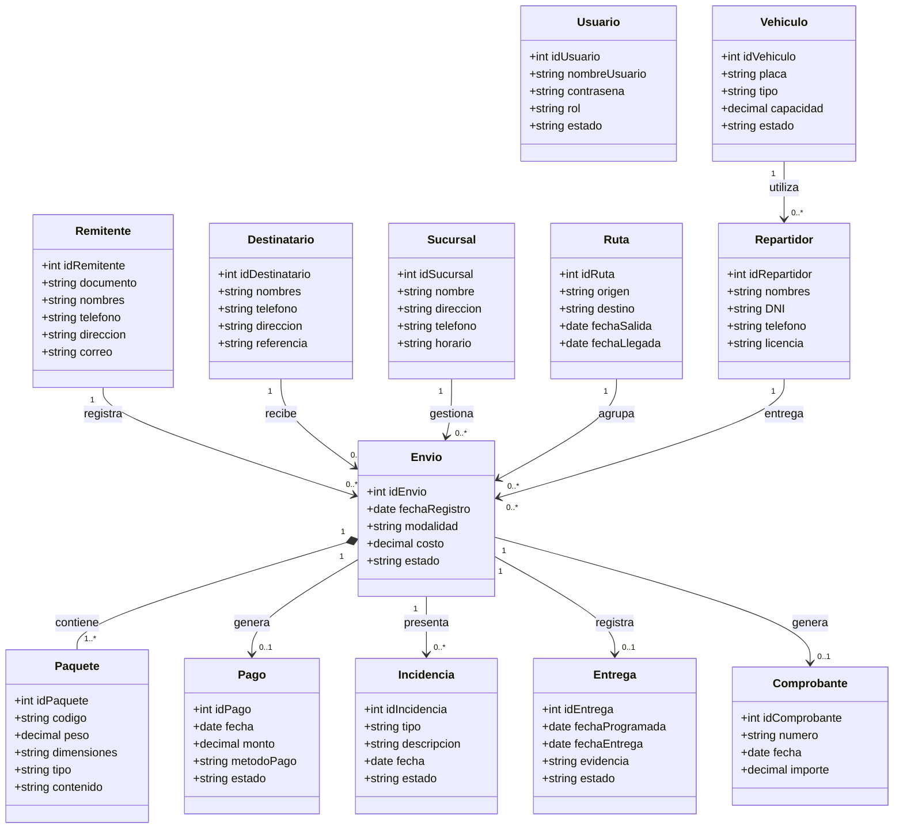
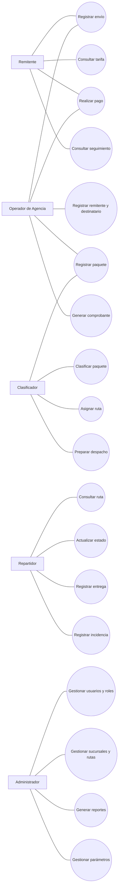
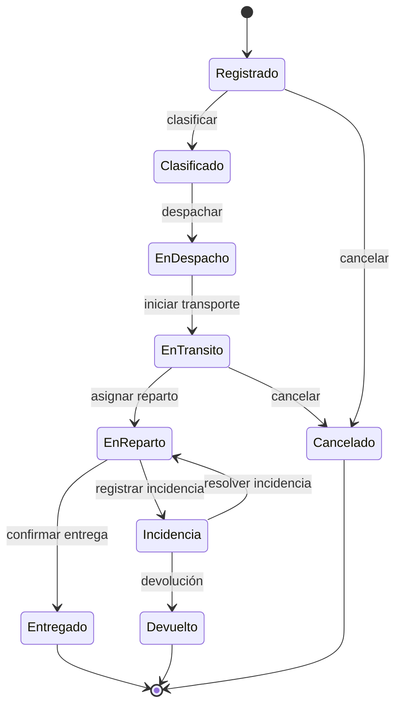
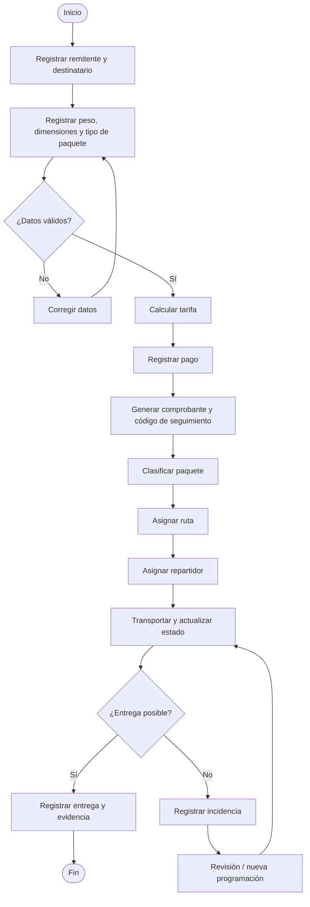
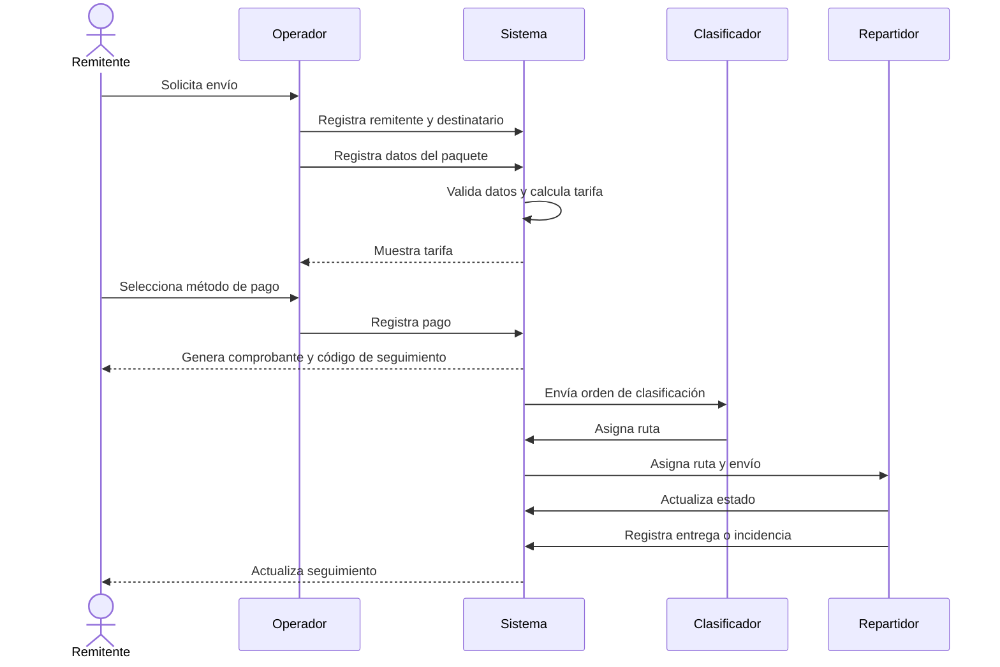
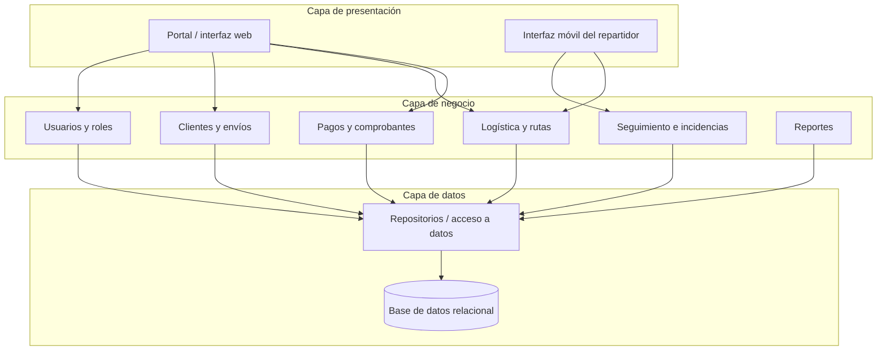

# RutaExpress — Diagramas para GitDiagram / Mermaid

## 1. Diagrama entidad-relación

## 2. Diagrama de clases

## 3. Casos de uso

## 4. Estados de un envío

## 5. Flujo de recepción y entrega

## 6. Diagrama de secuencia — Registrar envío y coordinar entrega

## 7. Arquitectura lógica

