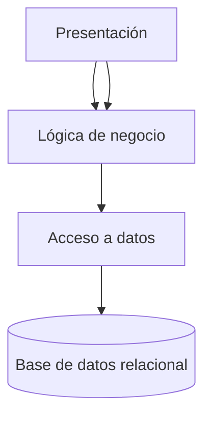

# Arquitectura lógica — RutaExpress

```mermaid
flowchart TD
P[Presentación] --> N[Lógica de negocio]
N --> D[Acceso a datos]
D --> DB[(Base de datos relacional)]
P --> N
```

Módulos de negocio: usuarios y roles, clientes/envíos, logística/rutas, pagos/comprobantes, seguimiento/incidencias y reportes.
