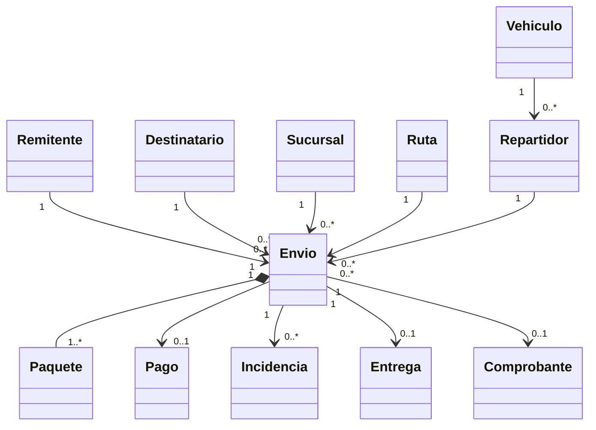

# Diagrama de clases — RutaExpress

```mermaid
classDiagram
class Remitente
class Destinatario
class Envio
class Paquete
class Sucursal
class Ruta
class Repartidor
class Vehiculo
class Pago
class Incidencia
class Entrega
class Comprobante
Remitente "1" --> "0..*" Envio
Destinatario "1" --> "0..*" Envio
Envio "1" *-- "1..*" Paquete
Sucursal "1" --> "0..*" Envio
Ruta "1" --> "0..*" Envio
Repartidor "1" --> "0..*" Envio
Vehiculo "1" --> "0..*" Repartidor
Envio "1" --> "0..1" Pago
Envio "1" --> "0..*" Incidencia
Envio "1" --> "0..1" Entrega
Envio "1" --> "0..1" Comprobante
```
