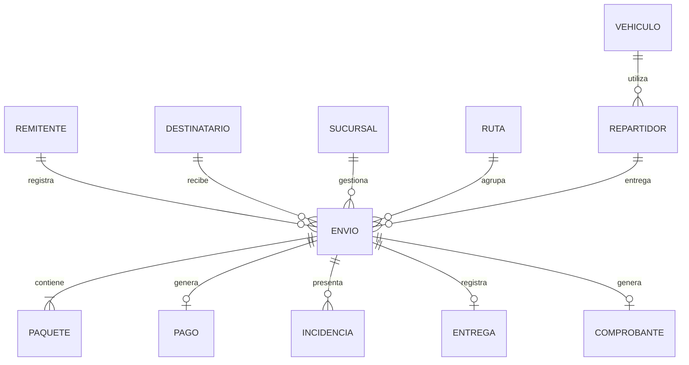

# Diagrama ER — RutaExpress

```mermaid
erDiagram
REMITENTE ||--o{ ENVIO : registra
DESTINATARIO ||--o{ ENVIO : recibe
SUCURSAL ||--o{ ENVIO : gestiona
RUTA ||--o{ ENVIO : agrupa
REPARTIDOR ||--o{ ENVIO : entrega
ENVIO ||--|{ PAQUETE : contiene
ENVIO ||--o| PAGO : genera
ENVIO ||--o{ INCIDENCIA : presenta
ENVIO ||--o| ENTREGA : registra
ENVIO ||--o| COMPROBANTE : genera
VEHICULO ||--o{ REPARTIDOR : utiliza
```

Para el modelo completo con atributos, revisar `RutaExpress_GitDiagram.md`.
