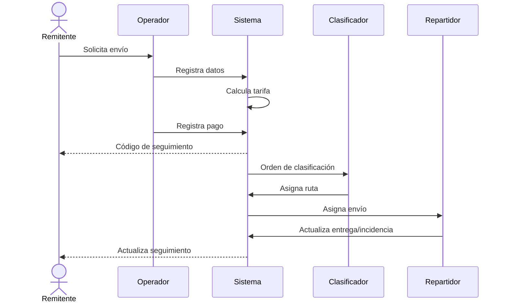

# Diagrama de secuencia — RutaExpress

```mermaid
sequenceDiagram
actor Remitente
participant Operador
participant Sistema
participant Clasificador
participant Repartidor
Remitente->>Operador: Solicita envío
Operador->>Sistema: Registra datos
Sistema->>Sistema: Calcula tarifa
Operador->>Sistema: Registra pago
Sistema-->>Remitente: Código de seguimiento
Sistema->>Clasificador: Orden de clasificación
Clasificador->>Sistema: Asigna ruta
Sistema->>Repartidor: Asigna envío
Repartidor->>Sistema: Actualiza entrega/incidencia
Sistema-->>Remitente: Actualiza seguimiento
```
