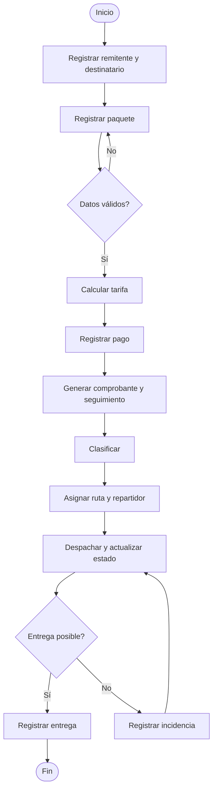

# Flujo de recepción y entrega

```mermaid
flowchart TD
I([Inicio]) --> R[Registrar remitente y destinatario]
R --> P[Registrar paquete]
P --> V{Datos válidos?}
V -->|No| P
V -->|Sí| T[Calcular tarifa]
T --> PA[Registrar pago]
PA --> B[Generar comprobante y seguimiento]
B --> C[Clasificar]
C --> A[Asignar ruta y repartidor]
A --> D[Despachar y actualizar estado]
D --> E{Entrega posible?}
E -->|Sí| F[Registrar entrega]
E -->|No| X[Registrar incidencia]
X --> D
F --> Z([Fin])
```
